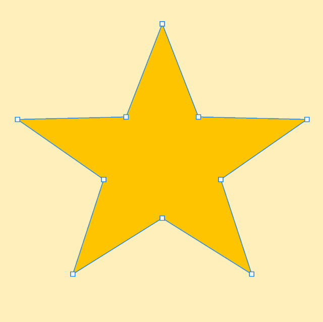
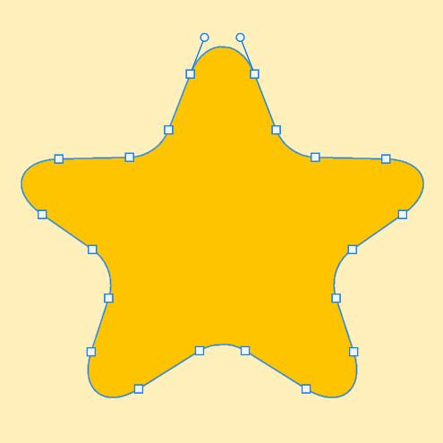
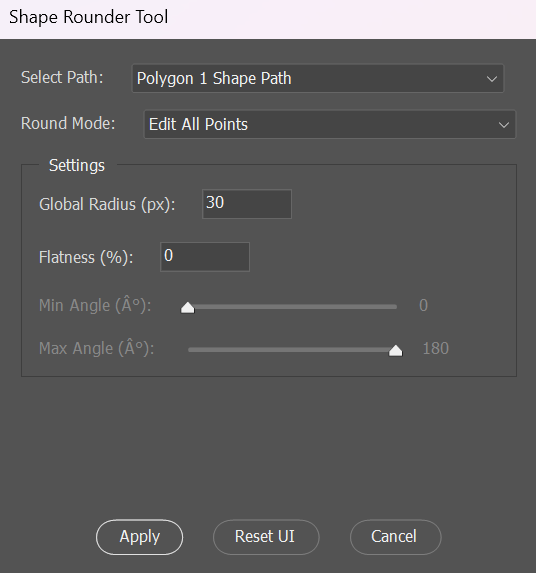
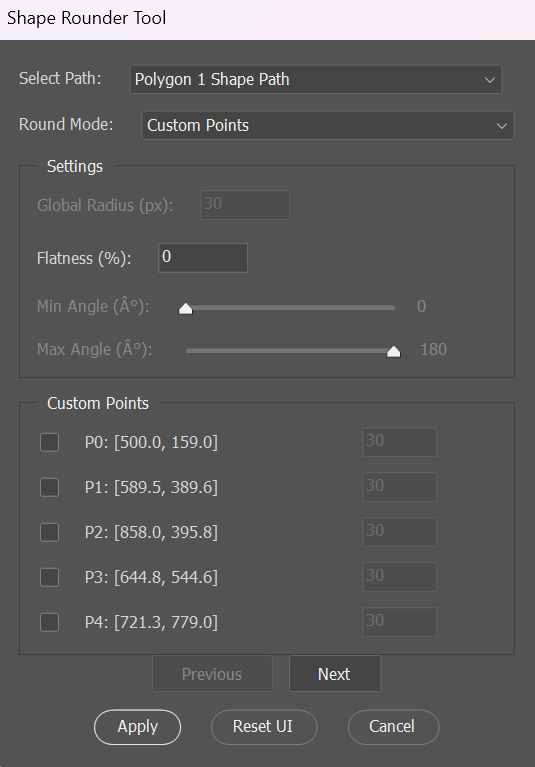
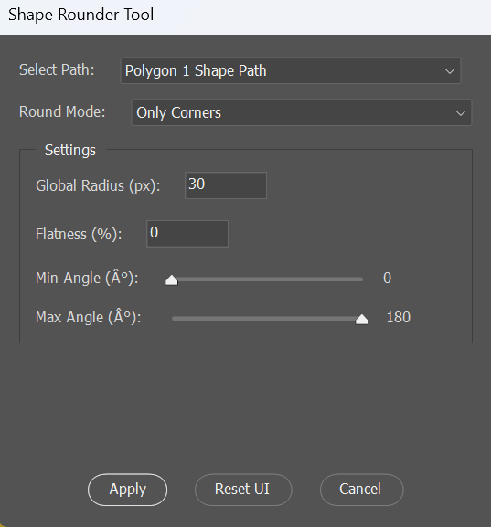

# ShapeRounder ✨

**ShapeRounder** is a powerful and precise Adobe Photoshop script designed to bring advanced vector path corner rounding capabilities directly into your workflow. Offering full per-point control, smart Bezier math, and a non-destructive editing process, it empowers you to refine any path with exceptional accuracy.

Unlike Photoshop’s native shape rounding—which is limited to specific live shapes like rectangles or rounded rectangles—ShapeRounder works universally on **any vector path**. This includes Work Paths, Vector Masks on layers, paths defining Shape Layers, and complex shapes drawn manually with the Pen Tool.

> **Note**: The name *ShapeRounder* was inspired by a similarly named commercial plugin. However, this script is an **independent project**, built entirely from scratch as a **free and open-source alternative**. It focuses on enhanced precision, customizable options, and aims to replicate Adobe’s native curvature formula as closely as possible within the ExtendScript environment.

---

## 📖 Table of Contents

1.  [Why ShapeRounder?](#-why-shaperounder)
2.  [✨ Features at a Glance](#-features-at-a-glance)
3.  [🖼️ Screenshots](#️-screenshots)
4.  [📂 Installation](#-installation)
    *   [Option 1: Manual Install (Recommended)](#option-1-manual-install-recommended)
    *   [Option 2: Run on Demand](#option-2-run-on-demand)
5.  [▶️ Usage Guide](#️-usage-guide)
    *   [Step 1: Prepare Your Path](#step-1-prepare-your-path)
    *   [Step 2: Launch ShapeRounder](#step-2-launch-shaperounder)
    *   [Step 3: Select the Target Path](#step-3-select-the-target-path)
    *   [Step 4: Choose a Rounding Mode](#step-4-choose-a-rounding-mode)
    *   [Step 5: Configure Settings](#step-5-configure-settings)
    *   [Step 6: Apply Rounding](#step-6-apply-rounding)
6.  [⚙️ Understanding the Settings](#️-understanding-the-settings)
    *   [Select Path](#select-path)
    *   [Round Mode](#round-mode)
    *   [Global Radius](#global-radius)
    *   [Flatness](#flatness)
    *   [Min/Max Angle Filter](#minmax-angle-filter)
    *   [Custom Points Panel](#custom-points-panel)
7.  [📐 The Rounding Algorithm Explained](#-the-rounding-algorithm-explained)
    *   [Bezier Arc Approximation](#bezier-arc-approximation)
    *   [Geometric Safety Limits](#geometric-safety-limits)
8.  [🛡️ Non-Destructive Workflow & Safety](#️-non-destructive-workflow--safety)
    *   [Automatic Backup](#automatic-backup)
    *   [Clear Output Naming](#clear-output-naming)
    *   [Handling Name Conflicts](#handling-name-conflicts)
    *   [Error Recovery (Undo Fallback)](#error-recovery-undo-fallback)
9.  [⚠️ Known Limitations & Considerations](#️-known-limitations--considerations)
10. [🚀 Future Plans](#-future-plans)
11. [🤝 Contributing](#-contributing)
12. [✍️ License](#️-license)
13. [💡 Development Insights](#-development-insights)
14. [💬 Credits & Acknowledgements](#-credits--acknowledgements)
15. [📌 Compatibility](#-compatibility)

---

## 🤔 Why ShapeRounder?

Vector path refinement is crucial for clean and professional designs. While Adobe Illustrator excels at this, Photoshop's native tools are often insufficient for complex paths or precise control. ShapeRounder bridges this gap by providing:

*   **Universal Path Support:** Works on *any* path type, not just basic shapes.
*   **Granular Control:** Choose between global rounding, angle-based filtering, or precise per-point radius adjustments.
*   **Mathematical Precision:** Uses a Bezier arc approximation formula reverse-engineered from Adobe Photoshop’s native shape rounding behavior. By analyzing the control points of live rounded shapes, ShapeRounder replicates the exact curvature formula for smooth, predictable results that match Adobe’s internal logic.
*   **Non-Destructive Process:** Your original path is always preserved.
*   **Free and Open Source:** An accessible tool for everyone.

It's built for designers, illustrators, and UI artists who need Illustrator-level corner rounding control without leaving Photoshop.

---

## ✨ Features at a Glance

*   **Universal Path Selection:** Select any vector path from your document (Work Path, Shape Layer path, Vector Mask path).
*   **Flexible Rounding Modes:**
    *   `Edit All Points`: Applies rounding to every eligible corner point.
    *   `Only Corners`: Rounds only points whose corner angle falls within a specified range (Min/Max Angle).
    *   `Custom Points`: Allows selection of specific points to round, each with its own custom radius value.
*   **Precise Bezier Math:** Implements accurate Bezier arc approximation using Adobe’s standard curvature formula for smooth results.
*   **Intelligent Geometry Limits:** Automatically calculates the maximum possible rounding based on adjacent segment lengths to prevent overlaps and glitches.
*   **Customizable Parameters:**
    *   Define a `Global Radius` for consistent rounding.
    *   Adjust `Flatness` to control the circularity of the curve (0% = circular arc).
    *   Set `Min Angle` and `Max Angle` thresholds for the `Only Corners` mode.
    *   Specify individual radii per point in `Custom Points` mode.
*   **User-Friendly Interface (ScriptUI):**
    *   Clear dropdowns for path and mode selection.
    *   Sliders and text fields for easy parameter input.
    *   **Paginated Point List:** Efficiently handles paths with many points in `Custom Points` mode, displaying points in manageable pages (3-5 points per page).
    *   Interactive checkboxes and radius inputs for per-point customization.
*   **Non-Destructive Workflow:**
    *   Automatically duplicates and renames the original path (e.g., `MyPath` becomes `MyPath (Original)`).
    *   Saves the modified path with a clear name (e.g., `MyPath (Rounded)`).
    *   Handles existing names by appending counters (e.g., `MyPath (Original) (1)`).
*   **Robust Error Handling:** Includes an undo fallback mechanism that attempts to restore the original path if an error occurs during processing.
*   **Subpath Compatibility:** Correctly processes both open and closed subpaths within a single path item.
*   **Transparency:** Outputs a `ShapeRounder_Log.txt` file on the user's Desktop for debugging purposes (optional, can be commented out if not needed).

---

## 🖼️ Screenshots

### 🔁 Before & After Example

<p align="center">
  
  &nbsp;&nbsp;
  
</p>
<p align="center"><em>Before and after rounding the corners of a star shape using ShapeRounder (same global radius).</em></p>

---

### 🪟 Window Menu
<p align="center">
  
  
  
</p>
<p align="center"><em>ShapeRounder UI</em></p>

---


## 📂 Installation

You have two ways to use ShapeRounder:

### Option 1: Manual Install (Recommended)

This makes the script readily available in Photoshop's Scripts menu.

1.  **Locate your Photoshop Scripts folder:**
    *   **Windows:** `C:\Program Files\Adobe\Adobe Photoshop [Version]\Presets\Scripts\`
    *   **macOS:** `/Applications/Adobe Photoshop [Version]/Presets/Scripts/`
    *(Replace `[Version]` with your specific Photoshop version, e.g., `Adobe Photoshop 2024`)*
    *(Note: You might need administrator privileges to copy files into Program Files on Windows)*
2.  **Copy `ShapeRounder.jsx`** into this `Scripts` folder.
3.  **Restart Adobe Photoshop.** If Photoshop was already running, you need to restart it for the script to appear in the menu.
4.  **Access the script** via `File > Scripts > ShapeRounder`.

### Option 2: Run on Demand

Use this method if you prefer not to install the script permanently.

1.  Save `ShapeRounder.jsx` to a convenient location on your computer (e.g., Desktop, a dedicated scripts folder).
2.  In Photoshop, go to `File > Scripts > Browse...`.
3.  Navigate to where you saved `ShapeRounder.jsx` and select it.
4.  Click **Open**. The script will run immediately.

---

## ▶️ Usage Guide

Follow these steps to round corners on your paths:

### Step 1: Prepare Your Path

Ensure your Photoshop document is open and contains at least one vector path. This can be:
*   A **Work Path** visible in the Paths panel.
*   The path associated with a **Shape Layer**.
*   The path defining a **Vector Mask** on any layer.

*(Tip: For best results, ensure your path doesn't have overlapping points or zero-length segments at the corners you intend to round.)*

### Step 2: Launch ShapeRounder

Go to `File > Scripts > ShapeRounder` (if installed) or `File > Scripts > Browse...` and select the `.jsx` file.

### Step 3: Select the Target Path

The ShapeRounder dialog window will appear.
*   Use the **Select Path** dropdown menu at the top to choose the path you want to modify. The list includes all valid paths found in your document. If you had a path selected in the Paths panel before launching, it should be pre-selected.

### Step 4: Choose a Rounding Mode

Select how you want to apply rounding using the **Round Mode** dropdown:

1.  **`Edit All Points`**: (Default) Attempts to round *every* corner point on the path using the `Global Radius` and `Flatness` settings. Open path endpoints are ignored.
2.  **`Only Corners`**: Rounds only those corner points where the angle between the incoming and outgoing segments falls within the specified `Min Angle` and `Max Angle` range. Uses the `Global Radius` and `Flatness`.
3.  **`Custom Points`**: Provides a list of all points on the selected path (paginated for long paths). You can:
    *   **Check the box** next to a point (`P0`, `P1`, etc.) to enable rounding for that specific point.
    *   **Enter a unique radius** value in the text field next to the checked point. If unchecked, the point remains unchanged.
    *   Use the **Previous** / **Next** buttons to navigate through pages if the path has many points.
    *   The `Global Radius` and `Angle Filter` settings are ignored in this mode. `Flatness` still applies.

### Step 5: Configure Settings

Adjust the parameters based on your chosen mode:

*   **`Global Radius (px)`**: (Used in `Edit All Points` & `Only Corners` modes) Sets the desired radius for the rounded corners in pixels.
*   **`Flatness (%)`**: (Used in all modes) Controls the shape of the curve. 0% creates a standard circular arc approximation. Higher values flatten the curve towards the original corner point (e.g., 100% results in almost no rounding).
*   **`Min Angle (°)` / `Max Angle (°)`**: (Used in `Only Corners` mode) Define the angle range (0° to 180°) for corners to be rounded. Use the sliders or check the numeric display.

### Step 6: Apply Rounding

*   Click the **Apply** button.
*   The script will:
    1.  Duplicate the original path and rename it (e.g., `MyPath (Original)`).
    2.  Create a new path with the rounded corners (e.g., `MyPath (Rounded)`).
    3.  Select the new rounded path in the Paths panel.

*   **Reset UI**: Click this button to revert all dialog settings to their default values.
*   **Cancel**: Click this button or close the dialog window to exit without making any changes.

---

## ⚙️ Understanding the Settings

*   **Select Path:** Dropdown listing all detected vector paths (Work Paths, Shape Layer paths, Vector Mask paths) in the current document.
*   **Round Mode:**
    *   `Edit All Points`: Round all possible corners globally.
    *   `Only Corners`: Round corners based on angle criteria.
    *   `Custom Points`: Manually select points and assign individual radii.
*   **Global Radius:** The target radius (in pixels) for rounded corners when using `Edit All Points` or `Only Corners` mode.
*   **Flatness:** A percentage (0-100%) that modifies the curve's control points.
    *   `0%`: Standard circular arc approximation. The Bezier control points are placed to best emulate a circular segment.
    *   `100%`: Maximum flatness. The control points move closer to the original corner, resulting in a very tight, almost non-existent curve. Useful for subtle breaks.
    *   Intermediate values allow for stylistic variations between a sharp corner and a full arc.
*   **Min/Max Angle Filter:** Sliders (0°–180°) defining the range of interior corner angles to target when using `Only Corners` mode. A sharp corner (like 90° on a square) has a smaller angle, while a shallow turn has a larger angle (closer to 180°).
*   **Custom Points Panel:** (Visible only in `Custom Points` mode)
    *   **Checkbox:** Enables/disables rounding for the corresponding point.
    *   **Point Label:** `P<index>` identifies the point globally across all subpaths (e.g., `P0`, `P1`, ...). Coordinates are shown for reference.
    *   **Radius Input:** Text field to enter the specific radius (in pixels) for this point *only when its checkbox is ticked*.
    *   **Pagination:** `Previous`/`Next` buttons appear if the path has more points than fit on one page (~5), allowing navigation through the list.

---

## 📐 The Rounding Algorithm Explained

ShapeRounder employs precise calculations to create smooth, geometrically sound rounded corners.

### Bezier Arc Approximation

The core of the rounding uses a standard formula to approximate a circular arc segment with a cubic Bezier curve. For a corner point `P` with adjacent points `P_prev` and `P_next`, and a target `radius`:

1.  **Calculate the Interior Angle (θ):** The angle formed by the segments `P_prev - P` and `P_next - P` is calculated.

2.  **Determine Offset Distance:** Points are moved along the segments away from the corner `P` to create space for the curve. The distance (`offset`) moved along each segment is calculated using:

    ```
    offset = min(
        radius / tan(θ_rad / 2),      // Theoretical distance needed to form the arc
        distance(P, P_prev) / 2,      // Limited by length of incoming segment
        distance(P, P_next) / 2       // Limited by length of outgoing segment
    )
    ```

    Where:
    - `radius` is the desired rounding radius set by the user.
    - `θ_rad` is the corner angle at point `P`, in **radians**.
    - `P` is the corner point to be rounded.
    - `P_prev` is the previous anchor point before `P` on the path.
    - `P_next` is the next anchor point after `P`.
    - `distance(a, b)` computes the Euclidean distance between points `a` and `b`.

    This ensures:
    - The curve fits safely between segments without extending too far.
    - The rounding is gracefully degraded when segments are too short.
    - The result maintains path integrity, avoiding overlaps or artifacts.

    If the calculated `offset` is near zero (due to tight geometry), rounding for that point is skipped automatically.

3.  **Calculate Bezier Handle Length (h):** The length of the Bezier control handles needed to approximate the arc is calculated using the formula:

    ```
    h = (4 / 3) * tan((π - θ_rad) / 4) * radius * (1 - flatness)
    ```

    Where:
    *   `θ_rad` is the corner angle in radians.
    *   `radius` is the desired corner radius.
    *   `flatness` is the user-defined flatness factor (0.0 to 1.0).

4.  **Position New Control Points:**
    *   The original corner point `P` is replaced by *two* new points, `A` and `B`.
    *   The control handle for `A` (extending towards `B`) is positioned along the vector `P - A`, with length `h`.
    *   The control handle for `B` (extending towards `A`) is positioned along the vector `P - B`, with length `h`.
    *   The other handles for `A` and `B` point directly at their respective anchor points (`A.rightDirection = A.anchor`, `B.leftDirection = B.anchor`), creating a smooth transition into the curve.

---

## 🛡️ Non-Destructive Workflow & Safety

ShapeRounder is designed to modify paths safely:

*   **Automatic Backup:** Before processing, the script *duplicates* the selected path. The original path is renamed by appending `(Original)` (e.g., `Path 1` becomes `Path 1 (Original)`). Your source path is never directly altered.
*   **Clear Output Naming:** The newly created path with rounded corners is named by appending `(Rounded)` to the original base name (e.g., `Path 1 (Rounded)`).
*   **Handling Name Conflicts:** If names like `Path 1 (Original)` or `Path 1 (Rounded)` already exist, the script automatically appends a counter (e.g., `Path 1 (Original) (1)`, `Path 1 (Rounded) (2)`) to ensure unique names.
*   **Error Recovery (Undo Fallback):** If an unexpected error occurs during the rounding process (e.g., due to highly complex or malformed path data), the script attempts to automatically restore the original path data to the renamed `(Original)` path item, minimizing data loss. A message will alert you if an error occurred and if restoration was attempted. You can then use Photoshop's regular Undo (`Ctrl+Z`/`Cmd+Z`) to revert the renaming and path creation steps.

---

## ⚠️ Known Limitations & Considerations

*   **No Live Preview:** Due to limitations of ExtendScript's ScriptUI, there is no live visual preview of the rounding on the canvas as you adjust parameters. You must click `Apply` to see the result.
*   **No Visual Point Markers:** The script cannot draw markers directly on the canvas to indicate which point corresponds to `P0`, `P1`, etc., in the `Custom Points` list. Users need to infer based on path order or coordinates.
*   **Single Path Processing:** The script processes only one selected path at a time. Batch processing multiple paths is not supported.
*   **ExtendScript Based:** This script uses Adobe's older ExtendScript engine. It is **not compatible** with newer UXP-based Photoshop environments directly (though it should run in modern Photoshop versions that still support ExtendScript, potentially via Rosetta on Apple Silicon).
*   **Vector Paths Only:** Cannot round corners of rasterized shapes, pixel layers, smart objects, or text layers directly. The target must be a genuine vector path.
*   **Performance:** On extremely complex paths with thousands of points, the script might take a noticeable moment to process, especially when populating the `Custom Points` list.
*   **Clipping Paths:** The script intentionally ignores paths designated as Clipping Paths to avoid unintended behavior with layer clipping.

---

## 🚀 Future Plans

Potential areas for future development include:

*   **UXP Plugin Rewrite:** Rebuilding the tool as a modern UXP plugin for improved performance, UI capabilities (like live preview), and future Photoshop compatibility.
*   **On-Canvas Point Identification:** Adding visual cues on the canvas to identify points selected in the UI.
*   **Live Curvature Preview:** Implementing a way to visualize the curve before applying.
*   **Radius Preset System:** Allow saving and loading common rounding configurations.
*   **Batch Processing:** Add support for rounding multiple selected paths simultaneously.
*   **Path Grouping:** Explore options for handling paths within layer groups.

---

## 🤝 Contributing

Contributions, bug reports, and feature suggestions are welcome! Please feel free to:
*   Open an issue on the GitHub repository (if applicable) to report bugs or suggest features.
*   Fork the repository, make your changes, and submit a pull request.

---

## ✍️ License

This project is licensed under the **MIT License**.

```
MIT License

Copyright (c) [Year] [Your Name/GitHub Username]

Permission is hereby granted, free of charge, to any person obtaining a copy
of this software and associated documentation files (the "Software"), to deal
in the Software without restriction, including without limitation the rights
to use, copy, modify, merge, publish, distribute, sublicense, and/or sell
copies of the Software, and to permit persons to whom the Software is
furnished to do so, subject to the following conditions:

The above copyright notice and this permission notice shall be included in all
copies or substantial portions of the Software.

THE SOFTWARE IS PROVIDED "AS IS", WITHOUT WARRANTY OF ANY KIND, EXPRESS OR
IMPLIED, INCLUDING BUT NOT LIMITED TO THE WARRANTIES OF MERCHANTABILITY,
FITNESS FOR A PARTICULAR PURPOSE AND NONINFRINGEMENT. IN NO EVENT SHALL THE
AUTHORS OR COPYRIGHT HOLDERS BE LIABLE FOR ANY CLAIM, DAMAGES OR OTHER
LIABILITY, WHETHER IN AN ACTION OF CONTRACT, TORT OR OTHERWISE, ARISING FROM,
OUT OF OR IN CONNECTION WITH THE SOFTWARE OR THE USE OR OTHER DEALINGS IN THE
SOFTWARE.
```
You are free to use, modify, fork, and share this script. Attribution is appreciated but not required.
---

## 💡 Development Insights

ShapeRounder was born from a desire to bring more robust vector tools into Photoshop's environment. The development involved a deep dive into:

*   **Vector Geometry & Bezier Mathematics:** Understanding how curves are defined and manipulated.
*   **Adobe Photoshop ExtendScript API:** Navigating the intricacies of scripting Photoshop's path objects and UI.
*   **ScriptUI Development:** Crafting an interactive and user-friendly interface within ExtendScript's constraints.
*   **Algorithm Design & Edge Case Handling:** Ensuring the rounding logic is robust and handles various path configurations gracefully (open/closed paths, short segments, sharp angles).

During development, **AI assistants (ChatGPT, Grok, Gemini)** were utilized as collaborative tools for exploring mathematical concepts, generating code snippets for specific algorithms (like Bezier approximation), debugging complex logic, and refining UI layouts. Every AI-generated suggestion was critically reviewed, tested, adapted, and integrated manually to ensure correctness and alignment with the project goals. The final script represents a custom-built solution tailored specifically for this rounding task.

---

## 💬 Credits & Acknowledgements

*   **Developed by:** Glooring - An indie developer passionate about enhancing creative workflows through scripting and automation.
*   **Inspiration:** Acknowledges the existence of commercial plugins with similar goals, which highlighted the need for a free, open-source alternative with detailed control.

---

## 📌 Compatibility

This script is designed for Adobe Photoshop versions that support **ExtendScript**.

| Feature / Environment      | Supported            | Notes                                      |
| :------------------------- | :------------------- | :----------------------------------------- |
| **Photoshop Versions**     | CC 2018 – CC 2024+   | ✅ (Tested primarily on newer CC versions) |
| **Operating System**       | Windows, macOS       | ✅                                         |
| **Apple Silicon (M1/M2+)** | ✅                   | Requires Photoshop to run under Rosetta 2  |
| **UXP Environment**        | ❌                   | This is an ExtendScript (.jsx) file         |
| **Path Types**             | Work Path, Shape Layer Path, Vector Mask Path | ✅ |
| **Path Types (Ignored)**   | Clipping Path        | ❌ (By design)                            |

*Note: Future major versions of Photoshop may phase out ExtendScript support in favor of UXP. This script will function as long as the ExtendScript engine is available.*

---

**Enjoy clean, perfect curves — on your terms — with ShapeRounder!**
