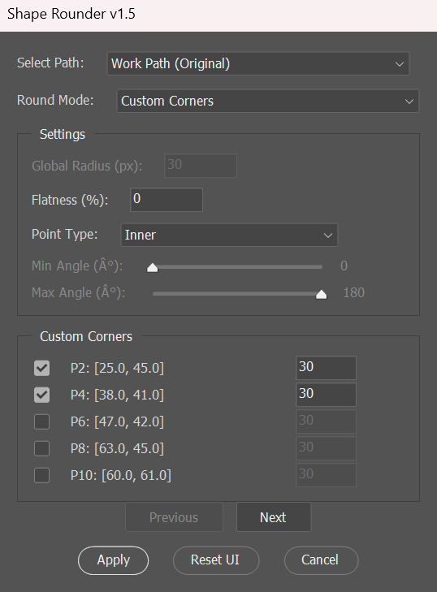

# ShapeRounder ✨ (v1.5)

**ShapeRounder** is a powerful and precise Adobe Photoshop script designed to bring advanced vector path corner rounding capabilities directly into your workflow. Offering sophisticated filtering, per-point/per-corner control, smart Bezier math, and a non-destructive editing process, it empowers you to refine any path with exceptional accuracy.

Unlike Photoshop’s native shape rounding—which is limited to specific live shapes like rectangles or rounded rectangles—ShapeRounder works universally on **any vector path**. This includes Work Paths, Vector Masks on layers, paths defining Shape Layers, and complex shapes drawn manually with the Pen Tool.

> **Note**: The name *ShapeRounder* was inspired by a similarly named commercial plugin. However, this script is an **independent project**, built entirely from scratch as a **free and open-source alternative**. It focuses on enhanced precision, customizable options, and aims to replicate Adobe’s native curvature formula as closely as possible within the ExtendScript environment.

---

## 🌟 Change Log (Summary)

*   **v1.0 (Initial):** Basic rounding for all points, angle filtering, custom point selection.
*   **v1.1/v1.2:** Introduced **Point Type Filter** ("All", "Inner", "Outer") to selectively round corners based on convexity/concavity in "Edit All Points" and "Only Corners" modes. Corrected initial logic for Inner/Outer detection.
*   **v1.3:** Enhanced **Custom Points** mode: The Point Type Filter now dynamically filters the list of points displayed, allowing users to focus on specific point types (All, Inner, Outer) for manual selection.
*   **v1.4:** Refined **"Only Corners"** mode: This mode now strictly targets only *geometric corners* (points where two straight line segments meet, with handles coincident with the anchor) that also satisfy the angle filter criteria.
*   **v1.5:** Added **"Custom Corners"** mode: A new mode that presents a list containing *only* the geometric corners of the path (further filtered by the Point Type Filter), allowing precise selection and radius assignment for true corners. The Point Type Filter is now always active and filters the list in both "Custom Points" and "Custom Corners" modes.

---

## 📖 Table of Contents

1.  [Why ShapeRounder?](#-why-shaperounder)
2.  [✨ Features at a Glance](#-features-at-a-glance)
3.  [🖼️ Screenshots](#️-screenshots)
4.  [📂 Installation](#-installation)
    *   [Option 1: Manual Install (Recommended)](#option-1-manual-install-recommended)
    *   [Option 2: Run on Demand](#option-2-run-on-demand)
5.  [▶️ Usage Guide](#️-usage-guide)
    *   [Step 1: Prepare Your Path](#step-1-prepare-your-path)
    *   [Step 2: Launch ShapeRounder](#step-2-launch-shaperounder)
    *   [Step 3: Select the Target Path](#step-3-select-the-target-path)
    *   [Step 4: Choose a Rounding Mode](#step-4-choose-a-rounding-mode)
    *   [Step 5: Configure Settings](#step-5-configure-settings)
    *   [Step 6: Apply Rounding](#step-6-apply-rounding)
6.  [⚙️ Understanding the Settings](#️-understanding-the-settings)
    *   [Select Path](#select-path)
    *   [Round Mode](#round-mode) **(Updated)**
    *   [Global Radius](#global-radius)
    *   [Flatness](#flatness)
    *   [Point Type Filter](#point-type-filter) **(Enhanced)**
    *   [Min/Max Angle Filter](#minmax-angle-filter)
    *   [Custom List Panel](#custom-list-panel) **(Enhanced)**
7.  [📐 The Rounding Algorithm Explained](#-the-rounding-algorithm-explained)
    *   [Bezier Arc Approximation](#bezier-arc-approximation)
    *   [Geometric Safety Limits](#geometric-safety-limits)
    *   [Geometric Corner Detection](#geometric-corner-detection) **(New)**
    *   [Point Type Detection (Inner/Outer)](#point-type-detection-innerouter) **(New)**
8.  [🛡️ Non-Destructive Workflow & Safety](#️-non-destructive-workflow--safety)
    *   [Automatic Backup](#automatic-backup)
    *   [Clear Output Naming](#clear-output-naming)
    *   [Handling Name Conflicts](#handling-name-conflicts)
    *   [Error Recovery (Undo Fallback)](#error-recovery-undo-fallback)
9.  [⚠️ Known Limitations & Considerations](#️-known-limitations--considerations)
10. [🚀 Future Plans](#-future-plans)
11. [🤝 Contributing](#-contributing)
12. [✍️ License](#️-license)
13. [💡 Development Insights](#-development-insights)
14. [💬 Credits & Acknowledgements](#-credits--acknowledgements)
15. [📌 Compatibility](#-compatibility)

---

## 🤔 Why ShapeRounder?

Vector path refinement is crucial for clean and professional designs. While Adobe Illustrator excels at this, Photoshop's native tools are often insufficient for complex paths or precise control. ShapeRounder bridges this gap by providing:

*   **Universal Path Support:** Works on *any* path type selectable in the Paths panel.
*   **Granular Control:** Choose between global rounding, angle-based filtering for true corners, precise per-point radius adjustments, or per-corner radius adjustments.
*   **Intelligent Filtering:** Selectively target points based on angle, geometric type (true corners vs. any point), and concavity (Inner/Outer). **(Enhanced)**
*   **Mathematical Precision:** Uses a Bezier arc approximation formula (based on user-provided logic) reverse-engineered from Adobe Photoshop’s native shape rounding behavior for smooth, predictable results.
*   **Non-Destructive Process:** Your original path is always preserved via duplication.
*   **Free and Open Source:** An accessible tool for everyone.

It's built for designers, illustrators, and UI artists who need Illustrator-level corner rounding control without leaving Photoshop.

---

## ✨ Features at a Glance

*   **Universal Path Selection:** Select any vector path from your document (Work Path, Shape Layer path, Vector Mask path) via the Paths panel.
*   **Flexible Rounding Modes (v1.5):**
    *   `Edit All Points`: Applies rounding to every eligible point, respecting the Point Type Filter.
    *   `Only Corners`: Rounds only points that are **geometric corners** (straight segments meeting at a point with coincident handles) *and* fall within the specified angle range (Min/Max Angle), respecting the Point Type Filter. **(Refined)**
    *   `Custom Points`: Presents a paginated list of points (filtered by the Point Type Filter) allowing selection of specific points to round, each with its own custom radius value. **(Enhanced List Filtering)**
    *   `Custom Corners`: Presents a paginated list containing *only* geometric corner points (further filtered by the Point Type Filter), allowing selection of specific corners to round, each with its own custom radius value. **(New Mode)**
*   **Point Type Filtering:**
    *   Filter points/corners processed in `Edit All Points`/`Only Corners` modes based on whether they are `All`, `Inner` (concave), or `Outer` (convex).
    *   Dynamically filters the list of points/corners shown in `Custom Points`/`Custom Corners` modes. **(Enhanced)**
*   **Precise Bezier Math:** Implements accurate Bezier arc approximation using the user-provided core formula for smooth results.
*   **Intelligent Geometry Limits:** Automatically calculates the maximum possible rounding based on adjacent segment lengths to prevent overlaps and glitches.
*   **Customizable Parameters:**
    *   Define a `Global Radius` for consistent rounding (used in `Edit All Points` & `Only Corners` modes).
    *   Adjust `Flatness` to control the circularity of the curve (0% = circular arc, applies to all modes).
    *   Set `Min Angle` / `Max Angle` thresholds for the `Only Corners` mode.
    *   Specify individual radii per point/corner in `Custom Points`/`Custom Corners` modes.
*   **User-Friendly Interface (ScriptUI):**
    *   Clear dropdowns for path and mode selection.
    *   Sliders and text fields for easy parameter input.
    *   **Dynamic Paginated List:** Efficiently handles paths with many points in `Custom Points`/`Custom Corners` modes, displaying filtered points/corners in manageable pages (approx. 5 per page). The list content and panel title update based on the selected mode and Point Type Filter. **(Enhanced)**
    *   Interactive checkboxes and radius inputs for per-item customization.
*   **Non-Destructive Workflow:**
    *   Automatically duplicates and renames the original path (e.g., `MyPath` becomes `MyPath (Original)`).
    *   Saves the modified path with a clear name (e.g., `MyPath (Rounded)`).
    *   Handles existing names by appending counters (e.g., `MyPath (Original) (1)`).
*   **Robust Error Handling:** Includes an undo fallback mechanism that attempts to restore the original path if an error occurs during processing.
*   **Subpath Compatibility:** Correctly processes both open and closed subpaths within a single path item.

---

## 🖼️ Screenshots

*(Note: Screenshots below may reflect earlier versions and might not show the "Custom Corners" mode or the dynamic list filtering. Updated screenshots are recommended for v1.5+.)*

### 🔁 Before & After Example

<p align="center">
  
  &nbsp;&nbsp;
  
</p>
<p align="center"><em>Before and after rounding the corners of a star shape using ShapeRounder.</em></p>

---

### 🪟 Window Menu (Examples)
<!--<p align="center">
  
  
  
</p>
<p align="center"><em>ShapeRounder UI (Examples from earlier versions)</em></p>-->

<p align="center">
  
</p>
<p align="center"><em>ShapeRounder UI</em></p>

---

## 📂 Installation

You have two ways to use ShapeRounder:

### Option 1: Manual Install (Recommended)

This makes the script readily available in Photoshop's Scripts menu.

1.  **Locate your Photoshop Scripts folder:**
    *   **Windows:** `C:\Program Files\Adobe\Adobe Photoshop [Version]\Presets\Scripts\`
    *   **macOS:** `/Applications/Adobe Photoshop [Version]/Presets/Scripts/`
    *(Replace `[Version]` with your specific Photoshop version, e.g., `Adobe Photoshop 2024`)*
    *(Note: You might need administrator privileges)*
2.  **Copy `ShapeRounder.jsx`** (v1.5 or later) into this `Scripts` folder.
3.  **Restart Adobe Photoshop.**
4.  **Access the script** via `File > Scripts > ShapeRounder`.

### Option 2: Run on Demand

Use this method if you prefer not to install the script permanently.

1.  Save `ShapeRounder.jsx` to a convenient location.
2.  In Photoshop, go to `File > Scripts > Browse...`.
3.  Navigate to where you saved `ShapeRounder.jsx` and select it. Click **Open**.

---

## ▶️ Usage Guide

Follow these steps to round corners on your paths:

### Step 1: Prepare Your Path

Ensure your Photoshop document is open and contains at least one vector path selectable in the Paths panel.

*(Tip: For best results, ensure your path doesn't have overlapping points or zero-length segments at the corners you intend to round.)*

### Step 2: Launch ShapeRounder

Go to `File > Scripts > ShapeRounder` (if installed) or `File > Scripts > Browse...` and select the `.jsx` file.

### Step 3: Select the Target Path

Use the **Select Path** dropdown menu at the top to choose the path you want to modify.

### Step 4: Choose a Rounding Mode

Select how you want to apply rounding using the **Round Mode** dropdown:

1.  **`Edit All Points`**: Attempts to round *every* eligible point on the path using the `Global Radius`, `Flatness`, and respecting the `Point Type Filter` setting. Open path endpoints are ignored.
2.  **`Only Corners`**: Rounds only points that are **geometric corners** (where two straight segments meet) *and* whose angle falls within the specified `Min Angle`/`Max Angle` range. Uses `Global Radius`, `Flatness`, and respects the `Point Type Filter`. **(Refined)**
3.  **`Custom Points`**: Provides a paginated list of points. The points shown in this list are filtered based on the **`Point Type Filter`** (`All`, `Inner`, or `Outer`). You can:
    *   Check the box next to a listed point (`P0`, `P1`, etc.) to enable rounding for that specific point.
    *   Enter a unique radius value in the text field next to the checked point.
    *   Use the **Previous** / **Next** buttons to navigate pages.
    *   `Global Radius` and `Angle Filter` settings are ignored. `Flatness` still applies. **(Enhanced List Filtering)**
4.  **`Custom Corners`**: Provides a paginated list containing *only* points identified as **geometric corners**. This list is *also* filtered based on the **`Point Type Filter`** (`All`, `Inner`, or `Outer`). You can:
    *   Check the box next to a listed corner (`P0`, `P1`, etc.) to enable rounding.
    *   Enter a unique radius value for the checked corner.
    *   Use the **Previous** / **Next** buttons to navigate pages.
    *   `Global Radius` and `Angle Filter` settings are ignored. `Flatness` still applies. **(New Mode)**

### Step 5: Configure Settings

Adjust the parameters based on your chosen mode:

*   **`Global Radius (px)`**: (Used in `Edit All Points` & `Only Corners` modes) Sets the desired radius for the rounded corners in pixels.
*   **`Flatness (%)`**: (Used in *all* modes) Controls the shape of the curve (0% = circular arc).
*   **`Point Type Filter`**: (Used in *all* modes)
    *   For `Edit All Points` / `Only Corners`: Filters which points/corners are *processed* based on type (`All`, `Inner`, `Outer`).
    *   For `Custom Points` / `Custom Corners`: Filters which points/corners are *displayed* in the list for selection.
*   **`Min Angle (°)` / `Max Angle (°)`**: (Used *only* in `Only Corners` mode) Define the angle range for geometric corners to be rounded.
*   **Custom List Inputs**: (Used in `Custom Points` / `Custom Corners` modes) Checkboxes and radius fields next to each listed item.

### Step 6: Apply Rounding

*   Click the **Apply** button.
*   The script duplicates the original path (`... (Original)`), creates the new rounded path (`... (Rounded)`), and selects it.
*   **Reset UI**: Reverts all dialog settings to defaults.
*   **Cancel**: Exits without changes.

---

## ⚙️ Understanding the Settings

*   **Select Path:** Dropdown listing detected vector paths from the Paths panel.
*   **Round Mode:** **(Updated for v1.5)**
    *   `Edit All Points`: Round all points that can form a corner (have neighbors), respecting the Point Type Filter.
    *   `Only Corners`: Round only points identified as **geometric corners** (straight segments meeting, handles at anchor) that fall within the Min/Max Angle range, respecting the Point Type Filter.
    *   `Custom Points`: Manually select points from a list. The list is filtered by the Point Type Filter (All/Inner/Outer). Assign individual radii.
    *   `Custom Corners`: Manually select *only* geometric corners from a list. This list is also filtered by the Point Type Filter (All/Inner/Outer). Assign individual radii.
*   **Global Radius:** Target radius (pixels) for `Edit All Points` & `Only Corners` modes.
*   **Flatness:** Percentage (0-100%) modifying curve control points (0% = circular). Applies to all modes.
*   **Point Type Filter:** **(Enhanced)** Dropdown (`All`, `Inner`, `Outer`).
    *   Filters points processed by `Edit All Points` / `Only Corners`.
    *   Filters points/corners *displayed* in the list for `Custom Points` / `Custom Corners`.
*   **Min/Max Angle Filter:** Sliders (0°–180°) defining the angle range *only* for the `Only Corners` mode.
*   **Custom List Panel:** **(Enhanced)** (Visible only in `Custom Points` / `Custom Corners` modes)
    *   **Title:** Dynamically changes to "Custom Points" or "Custom Corners".
    *   **Content:** List displays points or geometric corners, filtered by the `Point Type Filter`.
    *   **Checkbox:** Enables/disables rounding for the corresponding item.
    *   **Point Label:** `P<index>` identifies the point globally (using its original index on the full path). Coordinates shown for reference.
    *   **Radius Input:** Text field for specific radius when checkbox is ticked.
    *   **Pagination:** `Previous`/`Next` buttons for navigating long lists.

---

## 📐 The Rounding Algorithm Explained

ShapeRounder employs precise calculations using the user-provided core formula.

### Bezier Arc Approximation

The core rounding uses the following steps for a candidate corner point `P` with adjacent points `P_prev` and `P_next`, and a target `radiusToUse`:

1.  **Calculate Interior Angle (θ):** Angle between segments `P_prev - P` and `P_next - P`.
2.  **Determine Offset Distance:** Points `A` and `B` are placed along the segments away from `P`. The distance (`offset`) is calculated based on `radiusToUse`, `θ`, and limited by half the segment lengths (`l1/2`, `l2/2`) to prevent overlaps:
    ```javascript
    offset = Math.min(Math.abs(radiusToUse / Math.tan(thetaRad / 2.0)), l1 / 2.0, l2 / 2.0);
    ```
    *(Note: Absolute value used for robustness with tan)*
3.  **Calculate Bezier Handle Length (h):** Based on the arc angle (`PI - θ_rad`), the target radius (`radiusToUse`), and `flatness`:
    ```javascript
    h = (4 / 3) * Math.tan((Math.PI - thetaRad) / 4) * radiusToUse * (1 - params.flatness);
    ```
4.  **Position New Control Points:**
    *   Original corner `P` is replaced by new points `A` and `B`.
    *   Handles for `A` and `B` are calculated using `h` and positioned relative to the original corner `P` to create the curve. The other handles point directly at their anchors (`A.rightDirection = A.anchor`, `B.leftDirection = B.anchor`).

### Geometric Safety Limits

The `offset` calculation inherently limits the rounding radius based on the lengths of the incoming and outgoing path segments, preventing the curve from extending beyond the midpoint of either segment. This ensures path integrity.

### Geometric Corner Detection **(New)**

For the **`Only Corners`** and **`Custom Corners`** modes, the script identifies "geometric corners" by checking if a `PathPointInfo` object (`curr`):
*   Has `curr.kind === PointKind.CORNERPOINT`.
*   Has its `curr.leftDirection` handle coincident with its `curr.anchor` point (within tolerance).
*   Has its `curr.rightDirection` handle coincident with its `curr.anchor` point (within tolerance).
This distinguishes sharp corners formed by straight lines from smooth points or points on curves.

### Point Type Detection (Inner/Outer) **(New)**

The **`Point Type Filter`** uses the 2D cross-product of the vectors forming the corner (`P_prev - P` and `P_next - P`) to determine if a corner is `Inner` (concave, cross product > 0 in Y-down coordinates) or `Outer` (convex, cross product < 0). This filter applies to `Edit All Points`, `Only Corners`, and dynamically filters the lists in `Custom Points` and `Custom Corners` modes.

---

## 🛡️ Non-Destructive Workflow & Safety


ShapeRounder is designed to modify paths safely:

*   **Automatic Backup:** Duplicates the selected path and renames the original by appending `(Original)`.
*   **Clear Output Naming:** Creates the new path appending `(Rounded)`.
*   **Handling Name Conflicts:** Appends counters (`(1)`, `(2)`, etc.) if names already exist.
*   **Error Recovery (Undo Fallback):** Attempts to restore the original path data if an unexpected error occurs during processing.

---

## ⚠️ Known Limitations & Considerations

*   **No Live Preview:** Requires clicking `Apply` to see results.
*   **No Visual Point Markers:** Cannot visually mark points on canvas corresponding to the list items.
*   **Single Path Processing:** Processes one selected path at a time.
*   **ExtendScript Based:** Not compatible with UXP directly (runs via ExtendScript engine/Rosetta).
*   **Vector Paths Only:** Cannot round raster shapes, pixels, smart objects, text layers.
*   **Performance:** May lag on paths with thousands of points, especially populating custom lists.
*   **Clipping Paths:** Intentionally ignored.
*   **Complex Curves:** The definition of "geometric corner" is specific. Points on curves or points connecting a curve and a line will not be identified as geometric corners by the `Only Corners` or `Custom Corners` modes. Use `Edit All Points` or `Custom Points` for these.

---

## 🚀 Future Plans

Potential areas for future development include:

*   **UXP Plugin Rewrite:** Modern UXP version for better performance and UI (live preview).
*   **On-Canvas Point Identification:** Visual cues for selected points/corners.
*   **Radius Preset System:** Save/load common configurations.
*   **Batch Processing:** Support multiple selected paths.
*   **More Sophisticated Point Classification:** Option to identify points connecting curves and lines.

---

## 🤝 Contributing

Contributions, bug reports, and feature suggestions are welcome!

---

## ✍️ License

This project is licensed under the **MIT License**.

---

## 💡 Development Insights


ShapeRounder was born from a desire to bring more robust vector tools into Photoshop's environment. The development involved a deep dive into vector geometry, Bezier mathematics, the Adobe Photoshop ExtendScript API, and ScriptUI development. Ensuring the rounding logic was robust and handled various path configurations gracefully (open/closed paths, short segments, sharp angles, different point types) was a key focus. **Iterative refinement based on user feedback led to enhanced filtering options (Point Type, Geometric Corner), dynamic UI lists, and more precise mode definitions.**

During development, AI assistants (ChatGPT, Grok, Gemini) were utilized as collaborative tools for exploring mathematical concepts, generating code snippets for specific algorithms, debugging complex logic, and refining UI layouts. Every AI-generated suggestion was critically reviewed, tested, adapted, and integrated manually to ensure correctness and alignment with the project goals. The final script represents a custom-built solution tailored specifically for this rounding task, refined through multiple iterations.

---

## 💬 Credits & Acknowledgements

*   **Developed by:** Glooring - An indie developer passionate about enhancing creative workflows through scripting and automation.
*   **Inspiration:** Acknowledges the existence of commercial plugins with similar goals, which highlighted the need for a free, open-source alternative with detailed control.

---

## 📌 Compatibility

This script is designed for Adobe Photoshop versions that support **ExtendScript**.

| Feature / Environment      | Supported            | Notes                                      |
| :------------------------- | :------------------- | :----------------------------------------- |
| **Photoshop Versions**     | CC 2018 – CC 2024+   | ✅ (Tested primarily on newer CC versions) |
| **Operating System**       | Windows, macOS       | ✅                                         |
| **Apple Silicon (M1/M2+)** | ✅                   | Requires Photoshop to run under Rosetta 2  |
| **UXP Environment**        | ❌                   | This is an ExtendScript (.jsx) file         |
| **Path Types**             | Work Path, Shape Layer Path, Vector Mask Path | ✅ |
| **Path Types (Ignored)**   | Clipping Path        | ❌ (By design)                            |

*Note: Future major versions of Photoshop may phase out ExtendScript support...*

---

**Enjoy clean, perfect curves — on your terms — with ShapeRounder!**